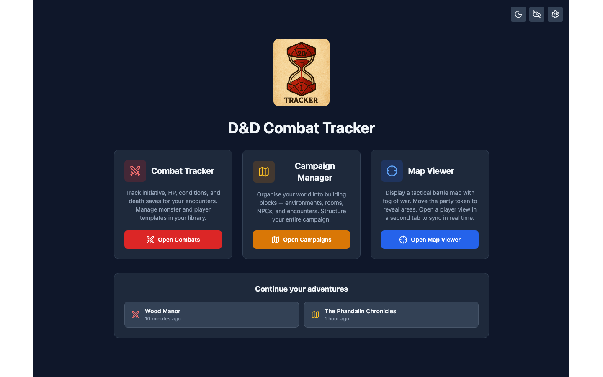
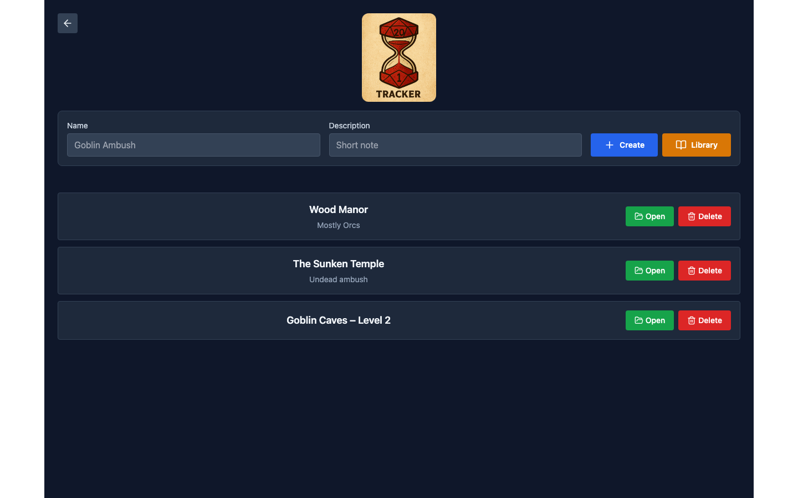
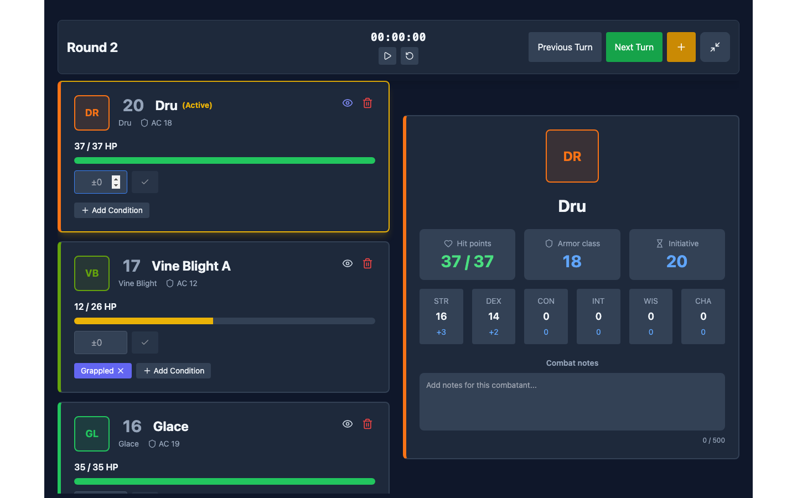
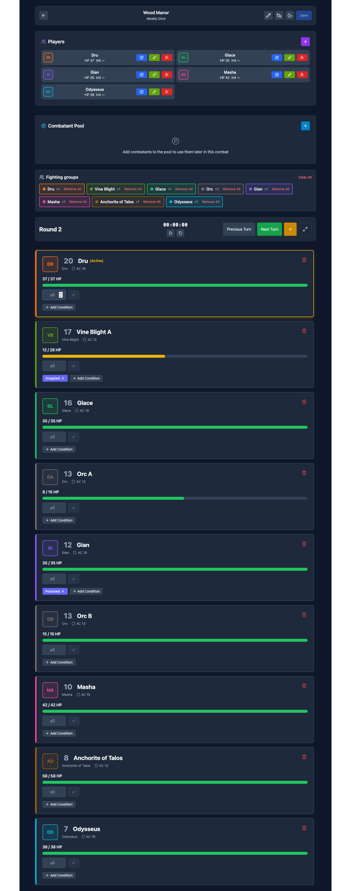
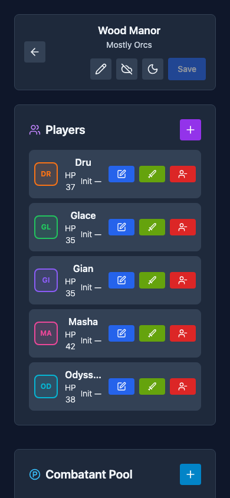
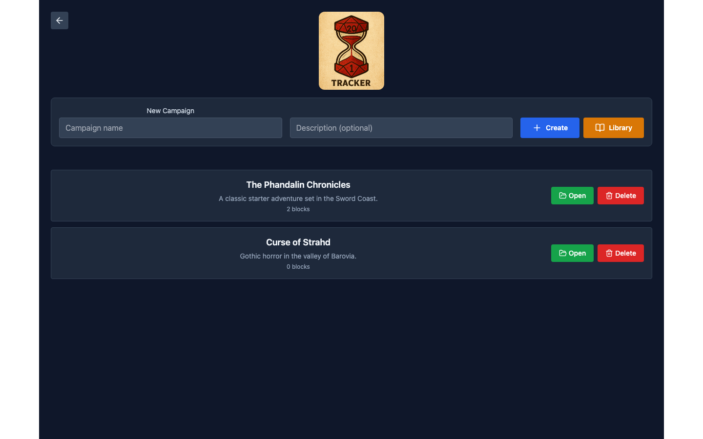
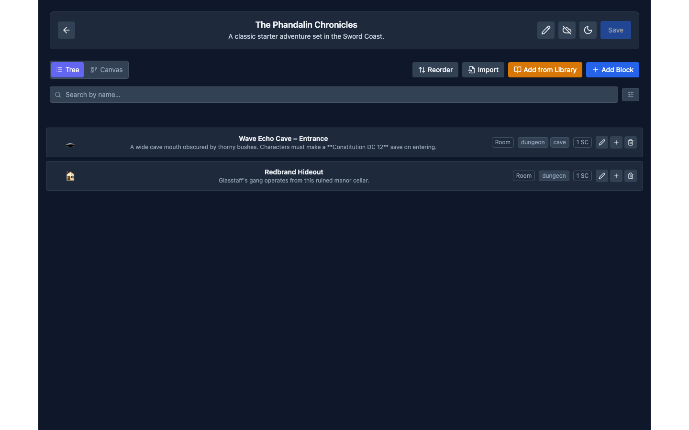
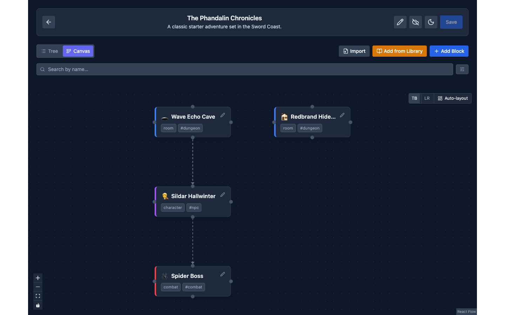
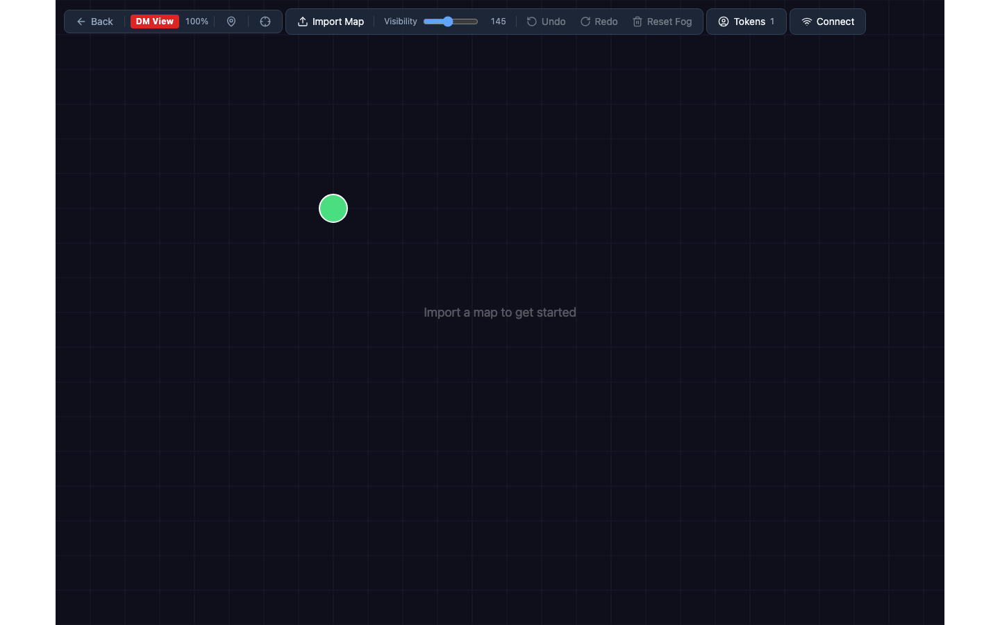

<p align="center">
  
</p>

# ⚔️ D&D Combat Tracker

> A modern, intuitive combat tracker for Dungeons & Dragons 5th Edition

[]()



<details>
<summary>📸 More Screenshots</summary>

**Combats list**


**Combat tracker – focus mode** (initiative order, HP bars, conditions, combatant detail)


**Combat tracker – full view** (players panel, combatant pool, fighting groups)


**Combat tracker – mobile**


**Campaign list**


**Campaign detail – tree view**


**Campaign detail – canvas view**


**Tactical map viewer**


</details>

[Try it!](https://yohannjouanneau.github.io/dnd-combat-tracker/)

## 🎯 Overview

D&D Combat Tracker is a web-based application designed to streamline combat encounters in Dungeons & Dragons 5e. Built for Dungeon Masters who want to focus on storytelling rather than bookkeeping, this tool handles initiative tracking, HP management, conditions, and more.

**Key Benefits:**

- ⚡ Lightning-fast combat setup with multi-combatant support
- 💾 Save and reuse players across multiple encounters
- 🔄 Cloud sync with Google Drive for seamless device switching
- 🎨 Visual feedback with color-coded groups and HP bars
- 📱 Responsive design works on desktop and mobile
- 🔒 All data stored locally by default - no account required
- ⌨️ Keyboard shortcuts for quick turn navigation
- 👁️ Focus Mode to minimize distractions during combat
- 🌍 Multi-language support (English & French)
- 🔍 Monster search powered by D&D 5e SRD API
- 📚 Personal monster library for custom creatures
- 📝 Rich Markdown notes with combat-specific tags and dice notation
- 🎯 Detailed combatant view with ability scores and modifiers
- 💡 Smart storage optimization with lightweight references
- 🗺️ Interactive tactical map viewer with fog of war and real-time P2P sync
- 📋 Campaign system with building blocks, notes, and visual canvas layout

## ✨ Features

### Combat Management

- **Initiative Tracking** with editable values and multiple groups per combatant
- **HP Management** with visual bars, quick buttons (mobile), and keyboard shortcuts
- **Turn Navigation** via keyboard (Arrow keys) with auto-scroll to active combatant
- **Focus Mode** to minimize distractions during combat
- **Group Management** with color coding and bulk actions

### Character & Monster Tools

- **Saved Players** - Reuse characters across encounters
- **Monster Library** - Build your personal collection with full stats and notes
- **Combatant Pool** - Stage combatants before adding to combat
- **D&D 5e SRD Integration** - Search and auto-fill official monsters
- **Bulk Creation** - Generate multiple combatants at once (e.g., "Goblin A, B, C")

### Combat Features

- **Death Saving Throws** tracking
- **Concentration** monitoring
- **Conditions** - Quick-toggle 14 standard D&D 5e conditions
- **Ability Scores** with automatic modifier calculations
- **Markdown Notes** with combat tags and dice notation

### Data & Sync

- **Local Storage** - All data saved in browser by default
- **Google Drive Sync** - Optional cloud backup across devices
- **Smart Storage** - Optimized references for library-sourced combatants
- **Combat History** - Save, rename, and load encounters

### Campaign System

- **Campaigns** - Organize sessions with hierarchical building blocks (rooms, characters, combats, loot, etc.)
- **Building Blocks** - Structured notes with Markdown support, stat checks, and linked NPCs
- **Custom Block Types** - Create your own block types with emoji icons and feature toggles
- **Visual Canvas** - Interactive node layout for visualizing campaign structure

### Tactical Map

- **Map Viewer** - Canvas-based tactical map with token placement and fog of war
- **Real-Time P2P Sync** - Share map with players via PeerJS (with BroadcastChannel fallback for local use)
- **DM/Player Views** - Separate DM view with full fog and player view with revealed areas
- **Token Management** - Create, move, and edit tokens; context menu for quick actions
- **Undo/Redo** - Full history of map actions

### User Interface

- **Responsive Design** - Optimized for desktop, tablet, and mobile
- **Multi-Language** - English and French support
- **Visual Feedback** - Color-coded HP bars, avatars, and toast notifications
- **Keyboard Shortcuts** - Navigate turns, save combats, and toggle modes

## 🛠️ Technology Stack

- **Frontend Framework**: React 19 with TypeScript
- **Build Tool**: Vite (Rolldown)
- **Styling**: Tailwind CSS
- **Icons**: Lucide React
- **Storage**: Browser LocalStorage + Google Drive (optional)
- **State Management**: Modular store hooks (Zustand-like pattern)
- **API Integration**: D&D 5e SRD GraphQL API
- **Internationalization**: i18next with browser language detection
- **Authentication**: Google Identity Services
- **Markdown**: react-markdown with remark-gfm
- **Canvas/Flow**: @xyflow/react for campaign visual canvas
- **P2P Networking**: PeerJS for real-time map sync
- **Emoji Picker**: emoji-mart for block type icons

## 🚀 Getting Started

> **Note:** This project is under active development! Features are being added regularly.

### Prerequisites

- Node.js 20.x or higher
- npm or yarn package manager
- (Optional) Google OAuth 2.0 Client ID for cloud sync features

### Installation

1. Clone the repository:

```bash
git clone https://github.com/yohannjouanneau/dnd-combat-tracker.git
cd dnd-combat-tracker
```

2. Install dependencies:

```bash
npm install
```

3. (Optional) Create a `.env` file for Google Drive sync:

```bash
VITE_GOOGLE_CLIENT_ID=your-google-client-id.apps.googleusercontent.com
```

4. Start the development server:

```bash
npm run dev
```

5. Open your browser to `http://localhost:5173`

### Building for Production

```bash
npm run build
```

The production-ready files will be in the `dist/` directory.

## 📖 Quick Start

### ⚔️ Combat Tracker

1. Go to **Combat Tracker** → name your encounter → **Create**
2. Add combatants manually or search the D&D 5e SRD (type a monster name in the form)
3. Use **`→` / `←`** to navigate turns; apply HP changes with the input field
4. Press **`F`** to enter Focus Mode — hides all panels, shows only the initiative list and combatant detail
5. **`Ctrl/Cmd+S`** to save progress

### 📋 Campaign Manager

1. Go to **Campaign Manager** → name your campaign → **Create**
2. Add **blocks** (rooms, characters, combats, loot…) with **+ Add Block**
3. Switch between **Tree** view (list) and **Canvas** view (interactive node graph)
4. Click any block to open its detail: Markdown notes, stat checks, linked NPCs, and linked combats

### 🗺️ Map Viewer

1. Go to **Map Viewer** → **Import Map** to upload a battle map image
2. Place tokens on the map; the DM view shows full fog, drag tokens to reveal areas
3. Click **Connect** to generate a room code — open the player view in a second tab to share the map in real time

## 📁 Project Structure

```
src/
├── api/
│   ├── sync/                    # Cloud sync providers
│   │   ├── gdrive/             # Google Drive implementation
│   │   ├── hooks/              # useSyncApi hook
│   │   ├── SyncProvider.ts
│   │   └── types.ts
│   ├── DnD5eGraphQLClient.ts   # D&D API client
│   ├── fragments.ts             # GraphQL fragments
│   └── types.ts                 # API type definitions
├── components/
│   ├── Campaign/                # Campaign building blocks UI
│   │   ├── BlockEditModal.tsx
│   │   ├── BlockDetailModal.tsx
│   │   └── BlockTreeNode.tsx
│   ├── CombatForm/              # Form for adding combatants
│   ├── CombatantsList/          # Combat participants display
│   ├── CombatLayout/            # Responsive layout components
│   │   ├── CombatLayout.tsx
│   │   ├── DesktopCombatLayout.tsx
│   │   └── MobileCombatLayout.tsx
│   ├── CombatantDetailPanel/    # Detailed combatant view
│   ├── CombatsList/             # Combat list page
│   ├── GroupsOverview/          # Group summary
│   ├── Library/                 # Unified monster/player/block library
│   ├── MapViewer/               # Tactical map with fog of war + P2P sync
│   ├── ParkedGroups/            # Staged combatants
│   ├── Settings/                # Settings modal
│   ├── TurnControls/            # Turn navigation + combat timer
│   ├── SyncButton.tsx           # Google Drive sync control
│   ├── TopBar.tsx               # Top navigation bar
│   └── common/                  # Reusable UI primitives (Button, Modal, Select, …)
├── contexts/                    # React contexts
│   ├── ThemeProvider.tsx
│   ├── ToastContext.tsx
│   ├── ToastProvider.tsx
│   └── ConfirmationDialogProvider.tsx
├── hooks/                       # Custom React hooks
│   ├── useConfirmationDialog.ts
│   ├── useMediaQuery.ts
│   ├── useSettings.ts
│   └── useTheme.ts
├── i18n/                        # Internationalization
│   ├── locales/
│   │   ├── en/                  # English translations
│   │   └── fr/                  # French translations
│   └── index.ts
├── pages/
│   ├── LandingPage.tsx
│   ├── CombatTrackerPage.tsx
│   ├── CombatsPage.tsx
│   ├── CampaignListPage.tsx
│   └── CampaignDetailPage.tsx
├── persistence/                 # Storage layer
│   ├── CombatStorageProvider.ts
│   ├── CombatantTemplateStorageProvider.ts
│   ├── CampaignStorageProvider.ts
│   ├── BuildingBlockStorageProvider.ts
│   ├── BlockTypeStorageProvider.ts
│   ├── MapStateStorageProvider.ts
│   ├── combatStateOptimizer.ts
│   └── storage.ts               # DataStore — single access point for all persistence
├── store/                       # State management
│   ├── hooks/                   # Store hooks
│   │   ├── useCombatantStore.ts
│   │   ├── useCombatStore.ts
│   │   ├── useCombatantFormStore.ts
│   │   ├── useMonsterStore.ts
│   │   ├── useParkedGroupStore.ts
│   │   ├── usePlayerStore.ts
│   │   └── useCampaignStore.ts
│   ├── state.ts
│   └── types.ts
├── types/
│   ├── campaign.ts              # Campaign, BuildingBlock, BlockTypeDef types
│   └── …
├── utils/                       # Utility functions
├── types.ts                     # Core TypeScript definitions
└── constants.ts                 # Storage keys, built-in block types, editor tags
```

## 🏗️ Architecture

### State Management

The application uses a modular store architecture with specialized hooks, composed by `useCombatState()` in `src/store/state.ts`:

- **useCombatantStore** - Combatants list with full stats and tracking
- **useCombatStore** - Current turn, round tracking, and combat metadata
- **useParkedGroupStore** - Combatant pool for staging
- **usePlayerStore** - Saved players for reuse
- **useMonsterStore** - Monster library management
- **useCombatantFormStore** - Form state for new combatants
- **useCampaignStore** - Campaigns, building blocks, and custom block types
- **useSyncApi** (`src/api/sync/hooks/`) - Google Drive sync state

Each store hook manages its own slice of state with dedicated actions and persistence logic.

### Data Flow

1. User interactions trigger state updates via store hooks
2. State changes propagate through React's component tree
3. Critical data is persisted to localStorage via storage providers
4. Optional cloud sync to Google Drive for cross-device access
5. On load, state is hydrated from localStorage or cloud

### Storage Strategy

- **Combat encounters**: Stored with unique IDs, timestamps, and optimized state snapshots
- **Saved players**: Stored separately for reuse across encounters
- **Monster library**: Personal collection of custom creatures
- **Smart optimization**: Combatants from libraries stored as lightweight references
  - Template data stored once in library
  - Combat snapshots only store runtime state (HP, conditions, initiative)
  - Automatic restoration merges template with runtime state on load
  - Significantly reduces storage footprint for large encounters
- **Manual save required**: Click "Save" button to persist combat changes
- **Data format**: JSON serialization with error handling
- **Storage keys**:
  - `dnd-ct:combats:v1` for combat encounters
  - `dnd-ct:players:v1` for saved players
  - `dnd-ct:monsters:v1` for monster library
  - `dnd-ct:blocks:v1` for campaign building blocks
  - `dnd-ct:campaigns:v1` for campaigns
  - `dnd-ct:block-types:v1` for custom block type definitions
  - `dnd-ct:map-state:v1` for tactical map state
  - `dnd-ct:map-room-code` for active P2P map room code
  - `dnd-ct:lastSynced` for sync timestamp
  - `dnd-ct:lastBackup` for last backup timestamp
  - `dnd-ct:settings:v1` for user settings

### API Integration

- **GraphQL Client**: Type-safe queries to D&D 5e SRD API
- **Caching**: 60-minute TTL for API responses
- **Fragment-based**: Reusable query fragments for consistency
- **Error Handling**: Graceful degradation if API is unavailable

### Cloud Sync Architecture

- **Provider Pattern**: Abstraction layer for sync implementations
- **Google Drive AppData**: Private, app-specific storage folder
- **Conflict Resolution**: Last-write-wins based on timestamps
- **Manual Sync**: User-initiated uploads/downloads
- **OAuth 2.0**: Secure authentication via Google Identity Services

## 🤝 Contributing

Contributions are welcome! Here's how you can help:

1. Fork the repository
2. Create a feature branch (`git checkout -b feature/amazing-feature`)
3. Commit your changes (`git commit -m 'Add amazing feature'`)
4. Push to the branch (`git push origin feature/amazing-feature`)
5. Open a Pull Request

### Development Guidelines

- Use TypeScript for all new code
- Follow existing code style and component patterns
- Keep components small and focused
- Add comments for complex logic
- Test your changes thoroughly
- Ensure responsive design works on mobile
- Update translations for both English and French
- Add confirmation dialogs for destructive actions

## 🗺️ Roadmap

### Planned Features or ideas

- [ ] Drag-and-drop initiative reordering
- [ ] Dice roller integration
- [ ] Spell slot tracking
- [ ] Export / Import combat JSON
- [ ] Temporary HP tracking

### Recently Added Features

- ✅ Tactical map viewer with fog of war and token management
- ✅ Real-time P2P map sync (PeerJS + BroadcastChannel)
- ✅ Campaign system with hierarchical building blocks
- ✅ Visual canvas layout for campaigns
- ✅ Custom block types with emoji icons
- ✅ Players included in unified Library
- ✅ Combat timer (turn timing in TurnControls)
- ✅ Google Drive cloud sync
- ✅ Multi-language support (English & French)
- ✅ Monster library system
- ✅ D&D 5e SRD API integration
- ✅ Dual search (library + API)
- ✅ Markdown notes with combat tags
- ✅ Combatant detail panel

### Known Limitations

- Cloud sync uses last-write-wins (no merge conflict resolution)
- No collaborative/multiplayer features
- Limited to browser localStorage capacity (~5-10MB) for local storage
- Image URLs must be publicly accessible
- Google Drive sync requires manual trigger

## 📄 License

This project is open source and available for personal use.

## 🙏 Acknowledgments

- **D&D 5e**: Wizards of the Coast for the amazing game system
- **D&D 5e SRD API**: For providing monster data
- **Lucide Icons**: Beautiful open-source icon library
- **Tailwind CSS**: For making styling enjoyable
- **React Community**: For excellent documentation and tools
- **i18next**: For making internationalization simple

## 📧 Contact

Project Link: [https://github.com/yohannjouanneau/dnd-combat-tracker](https://github.com/yohannjouanneau/dnd-combat-tracker)

---

**Made with ⚔️ for DMs everywhere**

_Roll for initiative!_ 🎲
